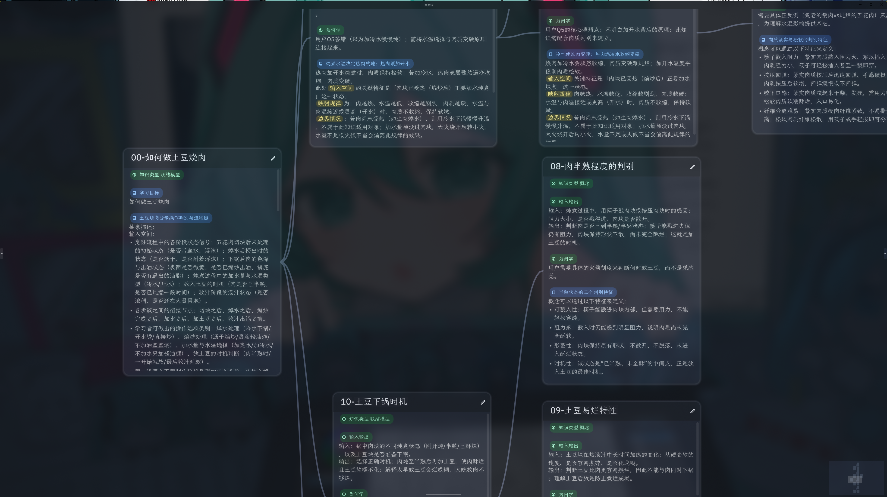

# Understand Everything

A desktop learning tool built on the 渐构 (gradual-construction) learning model from [modevol.com](https://www.modevol.com/) (《渐构：世界模型》): knowledge is constructed as discriminator models (concept cards) and connector models (knowledge cards) on a zoomable mind map — with explicit input/output spaces, route planning that builds discriminators before connectors, type-aware quizzes, and seen/unseen mastery tracking. Built with Rust + Makepad.

[中文版 / Chinese](README_zh.md)



## Run

```sh
cargo run
```

## Data directory

User data (cards, maps, references, settings, RAG cache, models) lives in the platform data dir, overridable via the `UE_DATA_DIR` env var:

| Platform | Path |
|---|---|
| Linux | `~/.local/share/understand-everything/` |
| macOS | `~/Library/Application Support/understand-everything/` |
| Windows | `%LOCALAPPDATA%\understand-everything\` |

Legacy data sitting next to the binary is migrated there on first launch.

## License

[GPL-3.0](LICENSE)
